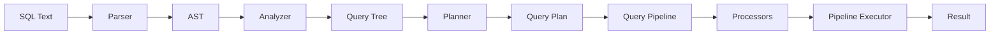
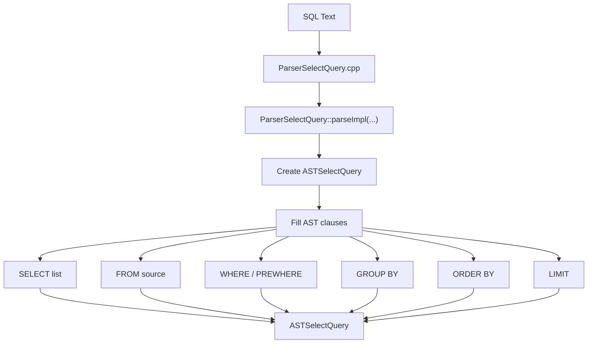
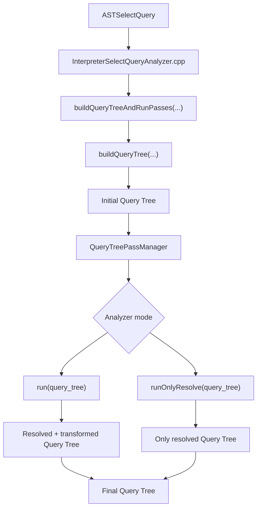
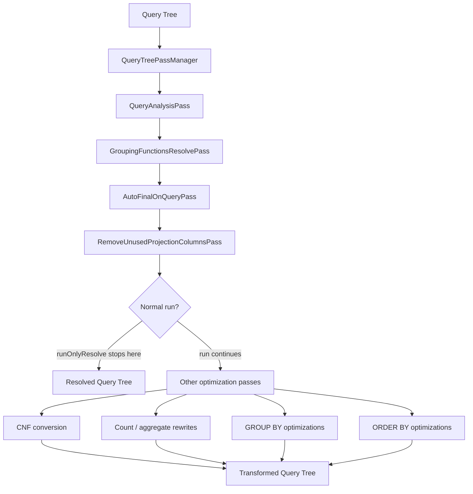
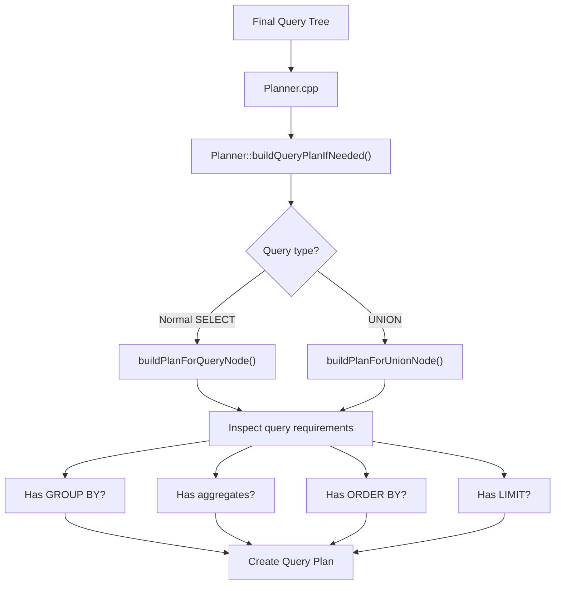
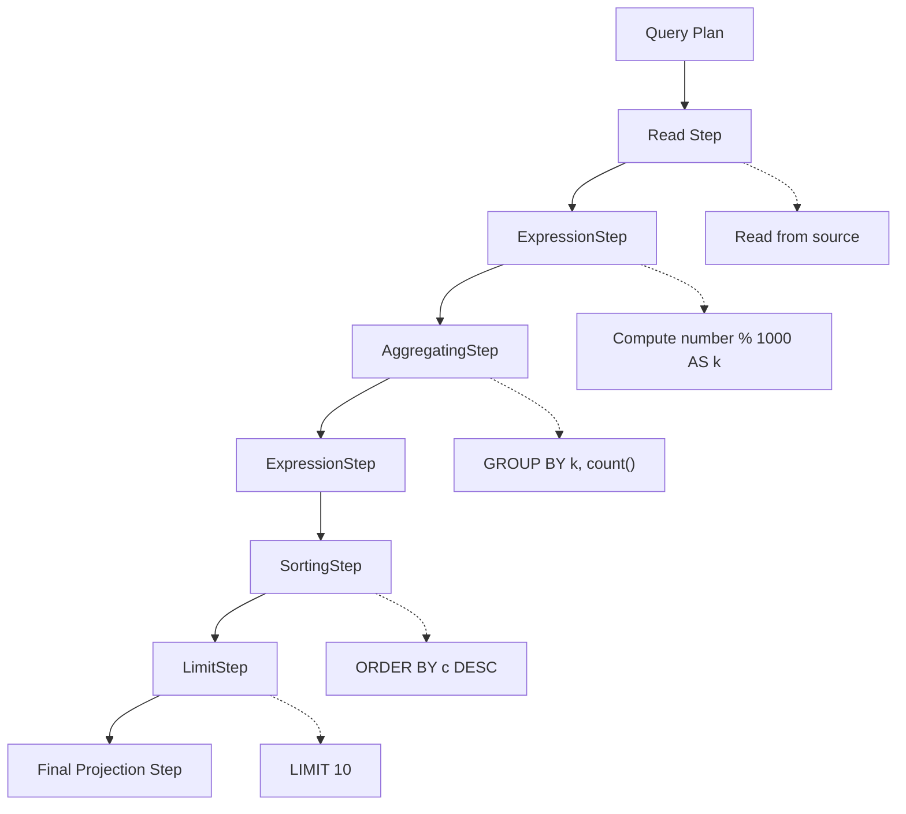
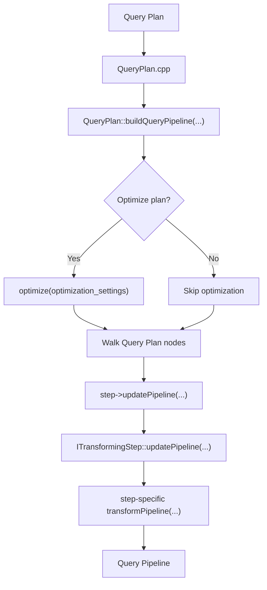
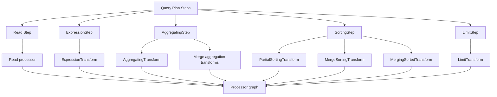
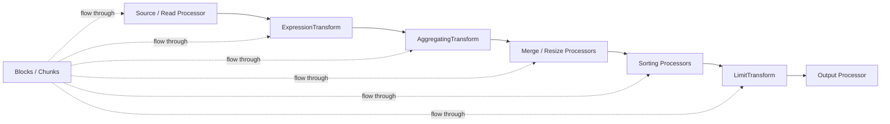
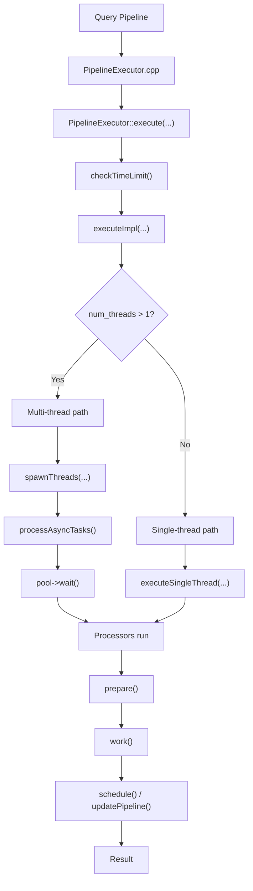

# ClickHouse — Query Execution


> Not a tutorial. Not documentation. A reverse-engineering journal of how one of the world's fastest database engines executes queries — from source code to controlled experiments.

---

While MergeTree handles the storage of data on disk, **ClickHouse's Query Execution Pipeline** is what actually processes that data at breakneck speeds. ClickHouse uses a **vectorized query execution engine**, meaning it processes data in chunks/blocks of columns rather than row-by-row.

The execution engine is built around a few core principles:

| Principle | What It Means |
|-----------|---------------|
| **Pipeline Processors** | Queries are translated into a graph of processors/transforms such as read, expression, filter, aggregation, sorting, and limit. |
| **Massive Parallelism** | Read streams and many pipeline processors can run in parallel, then merge later when required. |
| **Early Filtering & Optimizations** | ClickHouse tries to reduce unnecessary work early using optimizations such as constant folding, column pruning, PREWHERE movement, and plan/pipeline optimizations. |

---

## Project Scope

This project focuses on **ClickHouse Query Execution**.

The main execution path studied is:

```text
SQL text
  -> Parser
  -> AST
  -> Analyzer
  -> Query Tree
  -> Planner
  -> Query Plan
  -> Query Pipeline
  -> Processors
  -> Pipeline Executor
  -> Result
```

This project does **not** deeply analyze:

- Columnar storage internals
- MergeTree parts, marks, granules, sparse indexes, or background merges

Those are treated only as shallow read-source details because the focus is the query execution pipeline.

---

## Query Execution Flow



---

## Phase 1 — Parser: SQL Text to AST



**Key file:**

```text
src/Parsers/ParserSelectQuery.cpp
```

**Verified function:**

```cpp
bool ParserSelectQuery::parseImpl(Pos & pos, ASTPtr & node, Expected & expected)
```

The parser creates an `ASTSelectQuery` and fills it with syntactic SQL clauses such as `SELECT`, `FROM`, `WHERE`, `GROUP BY`, `ORDER BY`, and `LIMIT`.

---

## Phase 2 — Analyzer: AST to Query Tree



**Key files:**

```text
src/Interpreters/InterpreterSelectQueryAnalyzer.cpp
src/Analyzer/QueryTreePassManager.cpp
```

**Verified functions:**

```cpp
static QueryTreeNodePtr buildQueryTreeAndRunPasses(...)
void QueryTreePassManager::run(QueryTreeNodePtr & query_tree_node)
void QueryTreePassManager::runOnlyResolve(QueryTreeNodePtr & query_tree_node)
```

The analyzer gives meaning to the parsed AST. It resolves names, aliases, functions, aggregate functions, types, and projection columns.

---

## Phase 3 — Analyzer Pass Manager



ClickHouse uses many focused analyzer passes instead of one huge analyzer function.

Examples of passes found during source tracing:

```text
QueryAnalysisPass
GroupingFunctionsResolvePass
AutoFinalOnQueryPass
RemoveUnusedProjectionColumnsPass
PruneArrayJoinColumnsPass
ConvertLogicalExpressionToCNFPass
RegexpFunctionRewritePass
CountDistinctPass
NormalizeCountVariantsPass
OptimizeGroupByFunctionKeysPass
OptimizeGroupByInjectiveFunctionsPass
OptimizeRedundantFunctionsInOrderByPass
LogicalExpressionOptimizerPass
CrossToInnerJoinPass
DisableParallelReplicasPass
```

---

## Phase 4 — Planner: Query Tree to Query Plan



**Key file:**

```text
src/Planner/Planner.cpp
```

**Verified function:**

```cpp
void Planner::buildQueryPlanIfNeeded()
```

The planner decides what execution steps are required. For the representative query:

```sql
SELECT number % 1000 AS k, count() AS c
FROM numbers(1000000)
GROUP BY k
ORDER BY c DESC
LIMIT 10
```

ClickHouse needs expression evaluation, aggregation, sorting, limiting, and final projection.

---

## Phase 5 — Query Plan Steps



Important plan steps found in the source:

```text
ExpressionStep
AggregatingStep
SortingStep
LimitStep
DistinctStep
WindowStep
OffsetStep
```

---

## Phase 6 — Query Plan to Query Pipeline



**Key files:**

```text
src/Processors/QueryPlan/QueryPlan.cpp
src/Processors/QueryPlan/ITransformingStep.cpp
```

**Verified functions:**

```cpp
QueryPipelineBuilderPtr QueryPlan::buildQueryPipeline(...)
QueryPipelineBuilderPtr ITransformingStep::updatePipeline(...)
```

Each plan step contributes to the physical pipeline by adding processors/transforms.

---

## Phase 7 — Plan Steps Become Processors



Examples:

| Query Plan Step | Physical Pipeline Transform |
|---|---|
| `ExpressionStep` | `ExpressionTransform` |
| `AggregatingStep` | `AggregatingTransform` and merge aggregation transforms |
| `SortingStep` | `PartialSortingTransform`, `MergeSortingTransform`, `MergingSortedTransform` |
| `LimitStep` | `LimitTransform` |

---

## Phase 8 — Processor Pipeline



Processors are connected by ports, and data moves through the pipeline in blocks/chunks instead of row-by-row.

---

## Phase 9 — Pipeline Executor



**Key files:**

```text
src/Processors/IProcessor.h
src/Processors/Executors/PipelineExecutor.cpp
```

**Verified functions:**

```cpp
void PipelineExecutor::execute(size_t num_threads, bool concurrency_control)
void PipelineExecutor::executeImpl(size_t num_threads, bool concurrency_control)
```

The executor has both multi-thread and single-thread paths. It schedules processors, handles asynchronous work, catches exceptions, cancels the pipeline on failure, and returns the result or error to the client.

---

## Repository Structure

```text
ClickHouse-Query-Execution/
│
├── 📁 raw/                              # ClickHouse source code
│   └── ClickHouse/
│       ├── src/Parsers/                 # Parser source files
│       ├── src/Analyzer/                # Query Tree pass manager and analyzer passes
│       ├── src/Interpreters/            # Query analysis and expression analysis
│       ├── src/Planner/                 # Planner and Query Plan construction
│       ├── src/Processors/              # Query Plan, Pipeline, Transforms, Executors
│       └── src/Storages/MergeTree/      # MergeTree WHERE/PREWHERE optimizer
│
├── 📁 code-notes/                       # Our analysis and documentation
│   ├── design_decisions.md              # Design decisions from source tracing
│   ├── source_code_trace.md             # Source-code trace of the execution path
│   └── execution_pipeline.md            # Query Plan to Processor pipeline explanation
│
├── 📁 experiments/
│   ├── QEE1.png                         # Code modification for read parallelism
│   ├── QEE2_new.png                     # Corrected code modification for PREWHERE pushdown
│   ├── QEE3.png                         # Code modification for early constant folding
│   └── QEE4.png                         # Code modification for extra expression evaluation
│
├── 📁 Screenshots/                      # Result images for each experiment
│   ├── Screenshot 2026-05-12 013922.png # Exp 1 results
│   ├── Screenshot 2026-05-12 014246.png # Exp 2 results
│   ├── Screenshot 2026-05-12 014532.png # Exp 3 results
│   └── Screenshot 2026-05-12 014652.png # Exp 4 results
│
└── README.md
```

---

## Source Code Experiments

We modified ClickHouse C++ source code directly to isolate important execution behaviors, then compared performance using query metrics such as `query_ms`, `read_bytes`, `read_rows`, `selected_rows`, and `selected_marks`.

| Experiment | Source File Modified | Correct Interpretation |
|---|---|---|
| **Exp 1: Restrict Read Parallelism** | `src/Processors/QueryPlan/ReadFromMergeTree.cpp` | Restricts MergeTree read streams, so the same data is processed with less read parallelism. |
| **Exp 2: Disable WHERE to PREWHERE Pushdown** | `src/Storages/MergeTree/MergeTreeWhereOptimizer.cpp` | Prevents automatic movement of suitable `WHERE` conditions into `PREWHERE`. The filter remains correct, but early PREWHERE filtering is blocked. |
| **Exp 3: Disable Early Constant Folding** | `src/Interpreters/ExpressionAnalyzer.cpp` | Prevents early simplification of constant expressions, increasing CPU-side expression work. |
| **Exp 4: Force Extra Expression Evaluation** | `src/Processors/Transforms/ExpressionTransform.cpp` | Adds extra expression work on a copied block, then discards the result so output correctness and read volume remain unchanged. |

---

## Important Correction from Review

The first version of Experiment 2 modified:

```text
src/Processors/Transforms/FilterTransform.cpp
```

That location is **too late** in the pipeline to represent real filter pushdown. `FilterTransform` applies a row filter after data has already entered the processor pipeline.

The corrected experiment modifies:

```text
src/Storages/MergeTree/MergeTreeWhereOptimizer.cpp
```

This is the correct layer for testing automatic `WHERE` to `PREWHERE` movement.

The first version of Experiment 4 ran `expression->execute(...)` twice on the same mutated block. That increased runtime, but it also changed `read_bytes`, making the experiment less clean. The corrected version runs the extra expression evaluation on a copied block and discards it, then runs the real expression evaluation normally.

---

## Exact Source Code Changes

### Experiment 1 — Restrict Read Parallelism

**File:**

```text
src/Processors/QueryPlan/ReadFromMergeTree.cpp
```

**Change:** force the number of read streams to one.

```cpp
/// Query Execution Experiment 1: Restrict read parallelism.
const size_t num_streams = 1;
```

**Expected behavior:**

| Metric | Expected Change |
|---|---|
| `query_ms` | Increases |
| `read_rows` | Same |
| `read_bytes` | Same |
| Result correctness | Same |

---

### Experiment 2 — Disable Automatic WHERE to PREWHERE Pushdown

**File:**

```text
src/Storages/MergeTree/MergeTreeWhereOptimizer.cpp
```

**Function 1:**

```cpp
void MergeTreeWhereOptimizer::optimize(SelectQueryInfo & select_query_info, const ContextPtr & context) const
```

**Change:** add an early return at the top of the function.

```cpp
void MergeTreeWhereOptimizer::optimize(SelectQueryInfo & select_query_info, const ContextPtr & context) const
{
    /// Query Execution Experiment 2:
    /// Disable automatic WHERE -> PREWHERE pushdown.
    /// The filter remains in WHERE, so correctness is preserved.
    /// ClickHouse cannot use PREWHERE early column filtering for this query.
    return;

    auto & select = select_query_info.query->as<ASTSelectQuery &>();

    if (!select.where() || select.prewhere())
        return;

    // existing original code continues below
}
```

**Function 2:**

```cpp
MergeTreeWhereOptimizer::FilterActionsOptimizeResult MergeTreeWhereOptimizer::optimize(
    const ActionsDAG & filter_dag,
    const std::string & filter_column_name,
    const ContextPtr & context,
    bool is_final)
```

**Change:** add an early return at the top of this overload too.

```cpp
MergeTreeWhereOptimizer::FilterActionsOptimizeResult MergeTreeWhereOptimizer::optimize(
    const ActionsDAG & filter_dag,
    const std::string & filter_column_name,
    const ContextPtr & context,
    bool is_final)
{
    /// Query Execution Experiment 2:
    /// Disable ActionsDAG-based filter-to-PREWHERE optimization as well.
    return {};

    WhereOptimizerContext where_optimizer_context;

    // existing original code continues below
}
```

**Why this is the correct code change:**

This change does **not** remove the filter. It only prevents ClickHouse from moving the filter from `WHERE` into `PREWHERE`. The query result should remain correct, but ClickHouse loses the early-filtering advantage of PREWHERE.

**Expected behavior:**

| Metric | Expected Change |
|---|---|
| `query_ms` | Increases |
| `read_bytes` | Increases for queries where PREWHERE avoids reading extra columns |
| `read_rows` / `selected_rows` | May increase depending on the query and storage pruning behavior |
| Result correctness | Same |

> Note: If the row-count difference comes mainly from primary-key range pruning or mark pruning, then this is a different experiment from PREWHERE. In that case, the relevant source layer would be MergeTree range/mark selection, not only `MergeTreeWhereOptimizer.cpp`.

---

### Experiment 3 — Disable Early Constant Folding

**File:**

```text
src/Interpreters/ExpressionAnalyzer.cpp
```

**Function:**

```cpp
allowEarlyConstantFolding(...)
```

**Change:** force early constant folding to be disabled.

```cpp
/// Query Execution Experiment 3: Disable early constant folding.
return false;
```

**Expected behavior:**

| Metric | Expected Change |
|---|---|
| `query_ms` | Increases |
| `read_rows` | Same |
| `read_bytes` | Same |
| `selected_marks` | Same |
| Result correctness | Same |

This does not disable every expression optimization in ClickHouse. It specifically disables **early constant folding**, so the experiment should be described with that exact name.

---

### Experiment 4 — Force Extra Expression Evaluation Cleanly

**File:**

```text
src/Processors/Transforms/ExpressionTransform.cpp
```

**Function:**

```cpp
void ExpressionTransform::transform(Chunk & chunk)
```

**Corrected change:** run the extra expression evaluation on a copied block and discard the result.

```cpp
void ExpressionTransform::transform(Chunk & chunk)
{
    size_t num_rows = chunk.getNumRows();
    auto block = getInputPort().getHeader().cloneWithColumns(chunk.detachColumns());

    /// Query Execution Experiment 4:
    /// Force extra expression evaluation.
    /// Run the same expression once on a copied block and discard the result.
    /// This adds CPU expression work without changing the real output block.
    {
        auto extra_block = block;
        size_t extra_num_rows = num_rows;

        expression->execute(
            extra_block,
            extra_num_rows,
            false,
            false,
            [this]() { return isCancelled(); });
    }

    /// Normal real expression evaluation.
    expression->execute(
        block,
        num_rows,
        false,
        false,
        [this]() { return isCancelled(); });

    chunk.setColumns(block.getColumns(), num_rows);

    if (updater)
        updater->recordOutputChunk(chunk, block);
}
```

**Why this is the correct code change:**

The extra expression computation is added, but the actual output block is produced only once from the real `block`. This makes the experiment cleaner because only CPU-side expression evaluation should increase.

**Expected behavior:**

| Metric | Expected Change |
|---|---|
| `query_ms` | Increases |
| `read_rows` | Same |
| `read_bytes` | Same or almost same |
| `selected_rows` | Same |
| `selected_marks` | Same |
| Result correctness | Same |

---

## System Requirements

> **Warning:** Building ClickHouse from source requires significant resources.

| Component | Requirement |
|-----------|-------------|
| Operating System | Linux Ubuntu 20.04+ or macOS. Windows users should use **WSL2**. |
| RAM | Minimum 8 GB; more is strongly recommended for building. |
| Disk Space | **~70 GB** free for ClickHouse source and build artifacts. |
| Tools | `git`, `cmake`, `ninja`, `clang-14` or compatible Clang toolchain. |
| Build Time | Initial build can take several hours. Incremental rebuild after a small source change is much faster but still resource-heavy. |

---

## Build Instructions

> These steps are required to reproduce the experiments by modifying the ClickHouse C++ source code.

```bash
# Step 1 — Install build dependencies on Ubuntu
sudo apt-get install -y cmake ninja-build clang-14 libssl-dev

# Step 2 — Clone and navigate into ClickHouse source
git clone --recursive https://github.com/ClickHouse/ClickHouse.git raw/ClickHouse
cd raw/ClickHouse

# Step 3 — Apply the source code modification for one experiment only

# Step 4 — Create the build directory and compile
mkdir -p build && cd build
cmake .. -DCMAKE_BUILD_TYPE=RelWithDebInfo -G Ninja
ninja clickhouse-server clickhouse-client
```

> **Important:** Before building for a new experiment, revert any changes from the previous experiment. Do not mix two experiment patches in the same binary unless intentionally testing interaction effects.

---

## Running Each Experiment

| Experiment | What Was Tested | Clean Expected Result Pattern |
|---|---|---|
| **Exp 1: Restrict Read Parallelism** | `num_streams = 1` vs default parallel streams. | Same data read, slower query time. |
| **Exp 2: Disable WHERE to PREWHERE Pushdown** | Automatic PREWHERE movement disabled vs enabled. | More read work and slower query time when pushdown is blocked. |
| **Exp 3: Disable Early Constant Folding** | Heavy constant expressions with and without early folding. | Same read volume, higher CPU/query time. |
| **Exp 4: Extra Expression Evaluation** | Extra expression execution on copied block vs normal execution. | Same read volume, higher CPU/query time. |

---

## Experiment Results

<br/>

**Exp 1 — Parallel Disabled vs Enabled**


| State | query_ms | read_bytes | read_rows |
|---|---:|---:|---:|
| Parallel Disabled | 1422 | 1.30 GiB | 50,000,000 |
| Parallel Enabled | 811 | 1.30 GiB | 50,000,000 |

**Interpretation:** query execution time increased from 811 ms to 1422 ms, while the amount of data read stayed the same. This confirms that the experiment isolates read parallelism rather than changing query correctness or scan volume.

<br/>

**Exp 2 — PREWHERE Pushdown Enabled vs Blocked**


| State | query_ms | read_bytes | read_rows | selected_rows |
|---|---:|---:|---:|---:|
| Filter Early / Pushdown Used | ~10 | ~5.20 MiB | ~250,000 | ~250,000 |
| Filter Late / Pushdown Blocked | ~80–90 | ~67.21 MiB | ~5,034,112 | ~5,034,112 |

**Interpretation:** the result pattern is good for a pushdown experiment: when early filtering is blocked, ClickHouse reads more data and the query becomes slower. The important correction is that the source-code change should be in `MergeTreeWhereOptimizer.cpp`, not `FilterTransform.cpp`.

<br/>

**Exp 3 — Expression Optimized vs Not Simplified**


| State | query_ms | read_bytes | read_rows | selected_rows | selected_marks |
|---|---:|---:|---:|---:|---:|
| Expression Not Simplified | 87 | 67.21 MiB | 5,034,112 | 5,034,112 | 617 |
| Expression Optimized | 34 | 67.21 MiB | 5,034,112 | 5,034,112 | 617 |

**Interpretation:** early constant folding reduces CPU-side expression work. The read volume stays the same, but query time increases when simplification is disabled.

<br/>

**Exp 4 — Normal vs Extra Expression Evaluation**


| State | query_ms | read_bytes | read_rows | selected_rows | selected_marks |
|---|---:|---:|---:|---:|---:|
| Extra Expression Evaluation | ~75–85 | ~67.21 MiB | 5,034,112 | 5,034,112 | 617 |
| Normal Expression | ~40 | ~67.21 MiB | 5,034,112 | 5,034,112 | 617 |

**Interpretation:** the fixed implementation should increase query time but keep `read_bytes`, `read_rows`, `selected_rows`, and `selected_marks` the same. If `read_bytes` doubles, the experiment is not clean because extra expression work should not cause extra storage reads.

---

## Numbers That Matter

| Finding | Value | Experiment |
|---------|-------|------------|
| Slower execution without parallel read streams | **1.75× slower**: 1422 ms vs 811 ms | Exp 1 |
| Blocking early PREWHERE filtering increases read work | **~67.21 MiB vs ~5.20 MiB** read | Exp 2 |
| Blocking early constant folding increases CPU time | **2.5× slower**: 87 ms vs 34 ms | Exp 3 |
| Extra expression evaluation adds CPU overhead | **~2× slower**, with read volume expected to remain near **67.21 MiB** | Exp 4 |

---

## Final Validity of the Experiments

| Experiment | Valid? | Good? | Code Location Correct? | Result Interpretation |
|---|---|---|---|---|
| **Exp 1: Restrict Read Parallelism** | Yes | Yes | Yes, for MergeTree read stream parallelism | Same data read, slower query time. Good evidence. |
| **Exp 2: Disable WHERE to PREWHERE Pushdown** | Yes after correction | Yes | Corrected to `MergeTreeWhereOptimizer.cpp` | Good if described as PREWHERE pushdown, not all possible filter pruning. |
| **Exp 3: Disable Early Constant Folding** | Yes | Yes | Yes | Clean result: same read volume, higher query time. |
| **Exp 4: Extra Expression Evaluation** | Yes after correction | Yes | Yes | Clean expected result: same read volume, higher query time. |

---

## Conclusion

This project reverse-engineered the ClickHouse Query Execution Pipeline by tracing the source code and modifying selected execution paths.

| Experiment | Property Exposed | Observed / Expected Impact |
|---|---|---|
| Exp 1: Restrict Read Parallelism | Read-stream parallelism matters for throughput | Single-stream reading increased query time while reading the same amount of data. |
| Exp 2: Disable WHERE to PREWHERE Pushdown | Early filtering reduces unnecessary read work | Blocking PREWHERE movement caused more data to be read and increased runtime. |
| Exp 3: Disable Early Constant Folding | Analyzer-level expression simplification saves CPU | Unoptimized constant expressions slowed execution without changing scan volume. |
| Exp 4: Extra Expression Evaluation | ExpressionTransform contributes direct CPU cost | Extra expression work increased runtime while read volume should remain unchanged. |

ClickHouse's execution speed is not only about the MergeTree storage format. It also depends heavily on its staged query lowering process, vectorized processor pipeline, read parallelism, analyzer optimizations, PREWHERE filtering, and efficient expression transforms.

---
