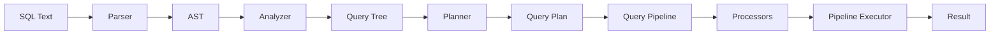

# ClickHouse — Query Execution


> Not a tutorial. Not documentation. A reverse-engineering journal of how one of the world's fastest database engines executes queries — from source code to controlled experiments.

---

While MergeTree handles the storage of data on disk, **ClickHouse's Query Execution Pipeline** is what actually processes that data at breakneck speeds. ClickHouse uses a **vectorized query execution engine**, meaning it processes data in chunks/blocks of columns rather than row-by-row.

The execution engine is built around a few core principles:

| Principle | What It Means |
|-----------|---------------|
| **Pipeline Processors** | Queries are translated into a graph of processors/transforms such as read, expression, filter, aggregation, sorting, and limit. |
| **Massive Parallelism** | Read streams and many pipeline processors can run in parallel, then merge later when required. |
| **Early Filtering & Optimizations** | ClickHouse tries to reduce unnecessary work early using optimizations such as constant folding, column pruning, PREWHERE movement, and plan/pipeline optimizations. |

---

## Project Scope

This project focuses on **ClickHouse Query Execution**.

The main execution path studied is:

```text
SQL text
  -> Parser
  -> AST
  -> Analyzer
  -> Query Tree
  -> Planner
  -> Query Plan
  -> Query Pipeline
  -> Processors
  -> Pipeline Executor
  -> Result
```

This project does **not** deeply analyze:

- Columnar storage internals
- MergeTree parts, marks, granules, sparse indexes, or background merges

Those are treated only as shallow read-source details because the focus is the query execution pipeline.

---

## Query Execution Flow



---

## Repository Structure

```text
ClickHouse-Query-Execution/
│
├── 📁 Experiments/
│   ├── QEE1.png                         # Code modification for read parallelism
│   ├── QEE2.png                         # Code modification for PREWHERE pushdown
│   ├── QEE3.png                         # Code modification for early constant folding
│   └── QEE4.png                         # Code modification for extra expression evaluation
│
├── 📁 Results/                      # Result images for each experiment
│   ├── Screenshot 2026-05-12 013922.png # Exp 1 results
│   ├── Screenshot 2026-05-12 014246.png # Exp 2 results
│   ├── Screenshot 2026-05-12 014532.png # Exp 3 results
│   └── Screenshot 2026-05-12 014652.png # Exp 4 results
│
└── README.md
```

---

## Source Code Experiments

We modified ClickHouse C++ source code directly to isolate important execution behaviors, then compared performance using query metrics such as `query_ms`, `read_bytes`, `read_rows`, `selected_rows`, and `selected_marks`.

| Experiment | Source File Modified | Interpretation |
|---|---|---|
| **Exp 1: Restrict Read Parallelism** | `src/Processors/QueryPlan/ReadFromMergeTree.cpp` | Restricts MergeTree read streams, so the same data is processed with less read parallelism. |
| **Exp 2: Disable Filter Pushdown** | `src/Storages/MergeTree/MergeTreeWhereOptimizer.cpp` | Prevents automatic movement of suitable `WHERE` conditions into `PREWHERE`. The filter remains correct, but early PREWHERE filtering is blocked. |
| **Exp 3: Disable Early Constant Folding** | `src/Interpreters/ExpressionAnalyzer.cpp` | Prevents early simplification of constant expressions, increasing CPU-side expression work. |
| **Exp 4: Force Extra Expression Evaluation** | `src/Processors/Transforms/ExpressionTransform.cpp` | Adds extra expression work on a copied block, then discards the result so output correctness and read volume remain unchanged. |

---

## Exact Source Code Changes

### Experiment 1 — Restrict Read Parallelism

**File:**

```text
src/Processors/QueryPlan/ReadFromMergeTree.cpp
```

**Change:** force the number of read streams to one.

```cpp
/// Query Execution Experiment 1: Restrict read parallelism.
const size_t num_streams = 1;
```

**Expected behavior:**

| Metric | Parallelism On | Parallelism Off |
|---|---|---|
| `query_ms` | 811 | 1422 |
| `read_rows` | 50 mil | 50 mil |
| `read_bytes` | 1.30 GB | 1.30 GB |

---

### Experiment 2 — Disable Filter Pushdown

**File:**

```text
src/Storages/MergeTree/MergeTreeWhereOptimizer.cpp
```

**Function 1:**

```cpp
void MergeTreeWhereOptimizer::optimize(SelectQueryInfo & select_query_info, const ContextPtr & context) const
```

**Change:** add an early return at the top of the function.

```cpp
void MergeTreeWhereOptimizer::optimize(SelectQueryInfo & select_query_info, const ContextPtr & context) const
{
    /// Query Execution Experiment 2:
    /// Disable automatic WHERE -> PREWHERE pushdown.
    /// The filter remains in WHERE, so correctness is preserved.
    /// ClickHouse cannot use PREWHERE early column filtering for this query.
    return;

    auto & select = select_query_info.query->as<ASTSelectQuery &>();

    if (!select.where() || select.prewhere())
        return;

    // existing original code continues below
}
```

**Function 2:**

```cpp
MergeTreeWhereOptimizer::FilterActionsOptimizeResult MergeTreeWhereOptimizer::optimize(
    const ActionsDAG & filter_dag,
    const std::string & filter_column_name,
    const ContextPtr & context,
    bool is_final)
```

**Change:** add an early return at the top of this overload too.

```cpp
MergeTreeWhereOptimizer::FilterActionsOptimizeResult MergeTreeWhereOptimizer::optimize(
    const ActionsDAG & filter_dag,
    const std::string & filter_column_name,
    const ContextPtr & context,
    bool is_final)
{
    /// Query Execution Experiment 2:
    /// Disable ActionsDAG-based filter-to-PREWHERE optimization as well.
    return {};

    WhereOptimizerContext where_optimizer_context;

    // existing original code continues below
}
```

**Why this is the correct code change:**

This change does **not** remove the filter. It only prevents ClickHouse from moving the filter from `WHERE` into `PREWHERE`. The query result should remain correct, but ClickHouse loses the early-filtering advantage of PREWHERE.

**Expected behavior:**

| Metric | Pushdown Used | Pushdown Blocked |
|---|---|---|
| `query_ms` | 10 | 87 |
| `read_bytes` | 5.2 MB | 67.21 MB |
| `read_rows` / `selected_rows` | 250k | 5 mil |

---

### Experiment 3 — Disable Early Constant Folding

**File:**

```text
src/Interpreters/ExpressionAnalyzer.cpp
```

**Function:**

```cpp
allowEarlyConstantFolding(...)
```

**Change:** force early constant folding to be disabled.

```cpp
/// Query Execution Experiment 3: Disable early constant folding.
return false;
```

**Expected behavior:**

| Metric | Expression Optimized | Expression Not Optimized |
|---|---|---|
| `query_ms` | 34 | 87
| `read_rows` | ~5 mil | ~5 mil
| `read_bytes` | 67.21 MB | 67.21 MB
| `selected_marks` | 617 | 617

This does not disable every expression optimization in ClickHouse. It specifically disables **early constant folding**.
---

### Experiment 4 — Force Extra Expression Evaluation Cleanly

**File:**

```text
src/Processors/Transforms/ExpressionTransform.cpp
```

**Function:**

```cpp
void ExpressionTransform::transform(Chunk & chunk)
```

**Corrected change:** run the extra expression evaluation on a copied block and discard the result.

```cpp
void ExpressionTransform::transform(Chunk & chunk)
{
    size_t num_rows = chunk.getNumRows();
    auto block = getInputPort().getHeader().cloneWithColumns(chunk.detachColumns());

    /// Query Execution Experiment 4:
    /// Force extra expression evaluation.
    /// Run the same expression once on a copied block and discard the result.
    /// This adds CPU expression work without changing the real output block.
    {
        auto extra_block = block;
        size_t extra_num_rows = num_rows;

        expression->execute(
            extra_block,
            extra_num_rows,
            false,
            false,
            [this]() { return isCancelled(); });
    }

    /// Normal real expression evaluation.
    expression->execute(
        block,
        num_rows,
        false,
        false,
        [this]() { return isCancelled(); });

    chunk.setColumns(block.getColumns(), num_rows);

    if (updater)
        updater->recordOutputChunk(chunk, block);
}
```

**Expected behavior:**

| Metric | Extra Expression Evaluation | Normal Expression
|---|---|---|
| `query_ms` | 81 | 43
| `read_rows` | ~5 mil | ~5 mil
| `read_bytes` | 67.21 MB | 67.21 MB
| `selected_rows` | ~5 mil | ~5 mil
| `selected_marks` | 617 | 617

---

## System Requirements

> **Warning:** Building ClickHouse from source requires significant resources.

| Component | Requirement |
|-----------|-------------|
| Operating System | Linux Ubuntu 20.04+ or macOS. Windows users should use **WSL2**. |
| RAM | Minimum 8 GB; more is strongly recommended for building. |
| Disk Space | **~70 GB** free for ClickHouse source and build artifacts. |
| Tools | `git`, `cmake`, `ninja`, `clang-14` or compatible Clang toolchain. |
| Build Time | Initial build: **12-14 hours**. Incremental rebuild after a small source change takes **45-60 minutes**. |

---

## Build Instructions

> These steps are required to reproduce the experiments by modifying the ClickHouse C++ source code.

```bash
# Step 1 — Install build dependencies on Ubuntu
sudo apt-get install -y cmake ninja-build clang-14 libssl-dev

# Step 2 — Clone and navigate into ClickHouse source
git clone --recursive https://github.com/ClickHouse/ClickHouse.git raw/ClickHouse
cd raw/ClickHouse

# Step 3 — Apply the source code modification for one experiment only from the above (or in the photos given in this repo)

# Step 4 — Create the build directory and compile
mkdir -p build && cd build
cmake .. -DCMAKE_BUILD_TYPE=RelWithDebInfo -G Ninja
ninja clickhouse-server clickhouse-client
```

> **Important:** Before building for a new experiment, revert any changes from the previous experiment. Do not mix two experiment patches in the same binary unless intentionally testing interaction effects.

---

## Running Each Experiment

| Experiment | What Was Tested | Clean Result Pattern |
|---|---|---|
| **Exp 1: Restrict Read Parallelism** | `num_streams = 1` vs default parallel streams. | Same data read, slower query time. |
| **Exp 2: Disable Filter Pushdown** | Automatic PREWHERE movement disabled vs enabled. | More read work and slower query time when pushdown is blocked. |
| **Exp 3: Disable Early Constant Folding** | Heavy constant expressions with and without early folding. | Same read volume, higher CPU/query time. |
| **Exp 4: Extra Expression Evaluation** | Extra expression execution on copied block vs normal execution. | Same read volume, higher CPU/query time. |


---

## Numbers That Matter

| Experiment | Finding | Value | 
|---------|-------|------------|
| Exp 1 | Slower execution without parallel read streams | **1.75× slower**: 1422 ms vs 811 ms | 
| Exp 2 | Blocking early PREWHERE filtering increases read work | **~67.21 MiB vs ~5.20 MiB** read and **87ms vs 10ms** | 
|  Exp 3 | Blocking early constant folding increases CPU time | **2.5× slower**: 87 ms vs 34 ms |
| Exp 4 | Extra expression evaluation adds CPU overhead | **~2× slower**: 81 ms vs 43 ms |

---

## Conclusion

This project reverse-engineered the ClickHouse Query Execution Pipeline by tracing the source code and modifying selected execution paths.

| Experiment | Property Exposed | Observed / Expected Impact |
|---|---|---|
| Exp 1: Restrict Read Parallelism | Read-stream parallelism matters for throughput | Single-stream reading increased query time while reading the same amount of data. |
| Exp 2: Disable Filter Pushdown | Early filtering reduces unnecessary read work | Blocking PREWHERE movement caused more data to be read and increased runtime. |
| Exp 3: Disable Early Constant Folding | Analyzer-level expression simplification saves CPU | Unoptimized constant expressions slowed execution without changing scan volume. |
| Exp 4: Extra Expression Evaluation | ExpressionTransform contributes direct CPU cost | Extra expression work increased runtime while read volume should remain unchanged. |

ClickHouse's execution speed is not only about the MergeTree storage format. It also depends heavily on its staged query lowering process, vectorized processor pipeline, read parallelism, analyzer optimizations, PREWHERE filtering, and efficient expression transforms.

---
